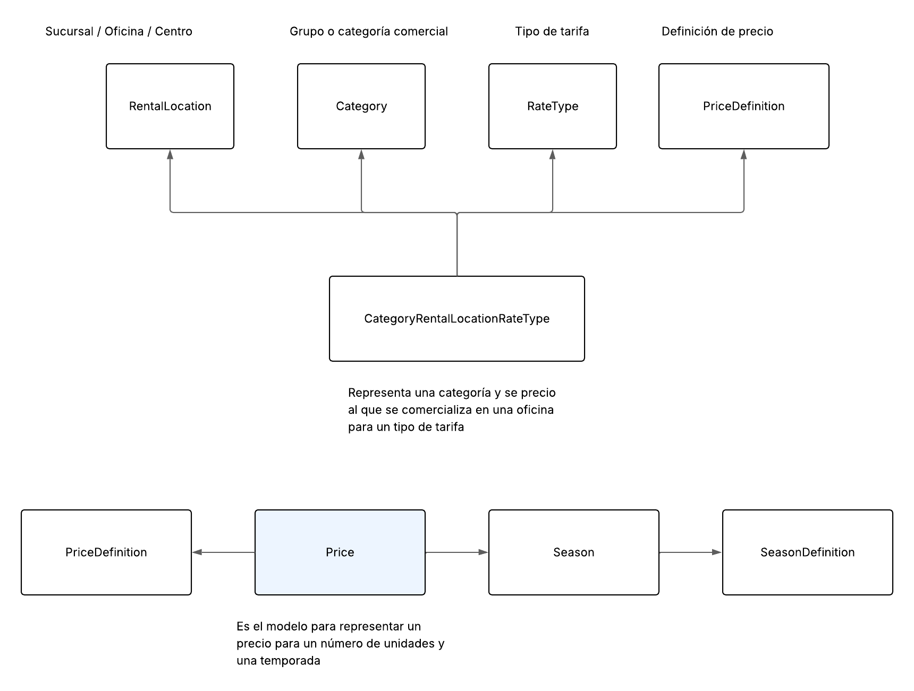

# Tareas

## Introducción

El objetivo de esta prueba técnica es implementar 2 funcionalidades relacionadas con la gestión de tarifas en el contexto de nuestra herramienta, un SaaS vertical para la gestión de empresas de alquiler de vehículos.

El proyecto, te explicamos en el fichero README.md cómo levantarlo, es una aplicación Ruby Sinatra. Aunque no tengas experiencia en el lenguaje las tareas son muy específicas. Los objetivos de las mismas son:

- Ver cómo te mueves con nuestra arquitectura.
- Ver cómo llevas a cabo una tarea pensada para una full stack
- Ver cómo llevas a cabo un proceso de carga de datos. Tarea pensada para una desarrollador back.

Para implementar estas tareas haz un fork de este repositorio e implementálo sobre tu fork. Lo revisaremos juntos.

### Modelo de datos

Aquí te explicamos el modelo de datos, simplificado, de las categorías y las tarifas que es lo que usarás para la resolución de las tareas.



#### Tipos de tarifa - RateType

Una empresa puede ofrecer varios tipos de tarifa con diferentes condiciones. Por ejemplo, un tipo de tarifa
estándar que incluye franquicia y una tarifa premium que tiene no obliga a franquicia al cliente.

#### Conjuntos de temporadas - SeasonDefinition

Una empresa puede tener diferentes temporadas para diferentes categorías de productos. Por ejemplo, puede tener
temporada alta, media y baja para scooters y sólo alta y media-baja para para turimos. También podrían tener 
períodos diferentes.

Además, existe una relación entrega los conjuntos de temporadas y las sucursales, ya que algunas sucursales podrían
definir sus propios conjuntos de temporadas.

#### Definición de precios - PriceDefinition

Este modelo permite definir un conjunto de precios que se vincula con una categoría,
una sucursal y un tipo de tarifa. D esta forma podemos desacoplamos el precio de la
categoría y permite aprovecharlo en otras partes del sistema como las tarifas de los extras.

Atributos a tener en cuenta:

- type : Indica que los precios se definen por temporadas o sin temporadas.

- excess: Importe de la franquicia
- deposit: Importe de la fianza

- time_measurement_months : El precio admite tarifas mensuales
- time_measurement_days : El precio admite tarifas diarias
- time_measurement_hours : El precio admite tarifas por horas
- time_measurement_minutes : El precio admite tarifas por minutos

- units_management_value_days_list : Lista separada por comas de los días para los que hay que definir precios.
  1,2,4,15 indica que se han de definir precios para 1 día, 2-3 días, 4-14 y 15 o más días. Sirve para saber qué
  columnas se han de rellenar.
- units_management_value_hours_list: Lo mismo para horas
- units_management_value_minutes_list: Lo mismo para minutos 

#### Precios - Price

Este modelo define un precio para una temporada y una duración (en meses, días, horas o minutos). 

Habrá un registro para 1 día de la temporada baja, otro para 2 días de la temporada media ...

Cada fila a mostrar en el resultado parte de una definición de precios y todos los precios para la temporada seleccionada,
o general si la definición del precio no incluye temporadas. 


#### Categorías - Category

Representa las categorías que se comercializan y para las que se configuran tarifas. Cuando se trata de una
empresa con múltiples sucursales no todas las categorías tienen porque comercializarse en todas las sucursales y
no para todos los tipos de tarifa. 
CategoryRentalLocationRateType permite la relación entre las categorías, las sucursales dónde se comercializan y las 
tarifas.

## Tarea 1

Implementar los servicios para poder mostrar los precios de múltiples productos en una única pantalla.

De entrada el usuario ha de seleccionar la sucursal. El resto de campos estarán desactivados y se irán activando
a medida que se vayan seleccionado.

- Cuando se seleccione la sucursal se han de cargar los tipos de tarifas que se ofrecen en esa sucursal.
- Cuando se seleccione el tipo de tarifa se cargarán los conjuntos de temporadas en función de los conjuntos de
temporadas que pueden usarse en la sucursal y de los precios que haya definido.
- Cuando se seleccione el conjunto de temporadas se cargarán las temporadas vinculadas. Se de poder seleccionar
sin temporadas lo que implica que se cargarán aquellas categorías con precios sin temporadas.
- Por último se podrá seleccionar la unidad : meses, días, horas y minutos. Los datos de prueba sólo contienen
tarifas diarias.
 


### Más detalles

- Puedes partir de la maquetación base que puedes ver en [Ejemplo funcional](../sample_task.html)
- Si necesitas montar una consulta SQL puedes ver el ejemplo de ListPricesService 

```ruby
      sql = <<-SQL
        select rl.name as rental_location_name,
               rt.name as rate_type_name,
               c.code as category_code, c.name as category_name,
               pd.id price_definition_id
        from price_definitions pd
        join category_rental_location_rate_types crlrt on pd.id = crlrt.price_definition_id
        join rental_locations rl on crlrt.rental_location_id = rl.id
        join rate_types rt on crlrt.rate_type_id = rt.id
        join categories c on crlrt.category_id = c.id;
      SQL

      Infraestructure::Query.run(sql)
```

## Tarea 2

Implementar el servicio para poder hacer una importación masiva de precios.

En la primera tarea hemos aplicado diferentes filtros para mostrar los precios por sucursal, tipo de tarifa y temporada.

¿Planterías la importación siguiendo estos filtros o añadirías las columnas de sucursal, tipo de tarifa y temporada?
Razona tu respuesta y haz la implementación en base a la misma.

- Implementa un JOB de importación que puedes llamar desde Rakefile si lo prefieres o bien implementa un end-point para hacer la importación. 

Has de tener en cuenta que si una definición de precio define los precios para 1,2,4,15 días el sistema no deberá cargar las tarifas de 30 días aunque estén en el CSV. Tendrás que preparar la opción de actualizar o crear la instancia de Price.
No se van a crear PriceDefinition. Se obtendrá a partir de la categoría, rental location y rate type buscando en CategoryRentalLocationRateType.


